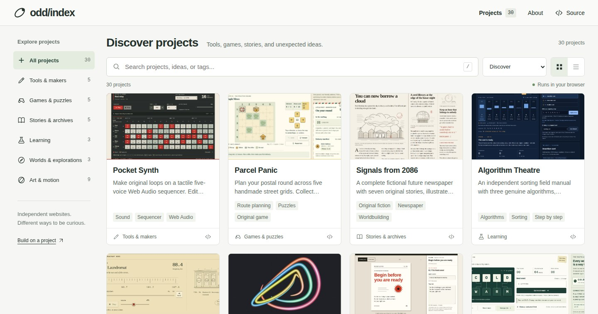

# odd/index

**A content-first collection of independent websites.** Tools to make with,
games to play, stories to read, and worlds that do not quite exist.

[Explore the collection](https://hspk.github.io/collections/)



The library is deliberately small: search, project types, useful previews,
and links. Projects are the main event. Each one opens its **own complete
website** at `/projects/<id>/`, with its own content, layout, and behavior.
There are no iframes and no requirement to fit a project inside an animation
viewport.

Everything is statically hosted and runs in the visitor's browser. "AI-made"
describes how this collection was created, not a hosted inference service.
There are no AI API keys, accounts, analytics, or backend functions. Some
projects keep preferences or work locally on the visitor's device.

## The websites

| Project | Kind | Inside |
|---------|------|--------|
| [The Museum of Unmade Things](https://hspk.github.io/collections/projects/museum/) | Stories & archives | An original speculative design museum and its impossible exhibits. |
| [Letters from Elsewhere](https://hspk.github.io/collections/projects/postcards/) | Stories & archives | An illustrated atlas of imaginary places and their correspondence. |
| [The Last Bookshop](https://hspk.github.io/collections/projects/bookshop/) | Stories & archives | A branching literary world with choices, discoveries, and endings. |
| [A Dictionary of Almost](https://hspk.github.io/collections/projects/almost/) | Stories & archives | Invented words for specific, not-quite-nameable experiences. |
| [Palette Kitchen](https://hspk.github.io/collections/projects/palette/) | Tools & makers | Color recipes, actual contrast ratios, and keepable palettes. |
| [Pixel Loom](https://hspk.github.io/collections/projects/pixel-loom/) | Tools & makers | Pixel drawing, fill, symmetry, undo, and image export. |
| [Transit Weaver](https://hspk.github.io/collections/projects/transit/) | Tools & makers | An editable fictional transit network and a map to take away. |
| [Zine Machine](https://hspk.github.io/collections/projects/zine/) | Tools & makers | A small print studio for an editable eight-page mini-zine. |
| [Nonogram Club](https://hspk.github.io/collections/projects/nonogram/) | Games & puzzles | Original picture-logic puzzles with real clues and solving tools. |
| [The Tiny Detective](https://hspk.github.io/collections/projects/detective/) | Games & puzzles | Nonviolent mysteries, evidence, and explainable deductions. |
| [Word Circuit](https://hspk.github.io/collections/projects/word-circuit/) | Games & puzzles | Word ladders with a real dictionary graph and useful hints. |
| [Parcel Panic](https://hspk.github.io/collections/projects/parcel/) | Games & puzzles | Postal route puzzles with pickups, deliveries, and undo. |
| [Garden of Rules](https://hspk.github.io/collections/projects/rules/) | Learning | Editable cellular automata, rules, presets, and step-by-step evolution. |
| [The Scale of Things](https://hspk.github.io/collections/projects/scale/) | Learning | Logarithmic size comparisons with clearly approximate facts. |
| [Algorithm Theatre](https://hspk.github.io/collections/projects/algorithms/) | Learning | Actual sorting traces with explanations and editable inputs. |
| [Recipe for a City](https://hspk.github.io/collections/projects/city/) | Worlds & explorations | A city-building toy with meaningful neighborhood rules. |
| [Signals from 2086](https://hspk.github.io/collections/projects/newspaper/) | Stories & archives | A clearly fictional future newspaper with full original stories. |
| [Atlas of Impossible Weather](https://hspk.github.io/collections/projects/weather/) | Worlds & explorations | Illustrated forecasts from imaginary destinations. |
| [Pocket Synth](https://hspk.github.io/collections/projects/synth/) | Tools & makers | An actual browser-based step sequencer. |
| [Radio 404](https://hspk.github.io/collections/projects/radio/) | Worlds & explorations | Locally synthesized stations from fictional places. |
| [Orbital](https://hspk.github.io/collections/projects/orbital/) | Art & motion | Polished kinetic rings and material studies. |
| [Flow State](https://hspk.github.io/collections/projects/flow/) | Art & motion | A dense, touchable vector-field particle study. |
| [Soft Signal](https://hspk.github.io/collections/projects/soft/) | Art & motion | Organic merging and separating liquid forms. |
| [Terrarium](https://hspk.github.io/collections/projects/terrain/) | Art & motion | Procedural landscapes, contours, and biomes. |
| [Chroma](https://hspk.github.io/collections/projects/chroma/) | Art & motion | Domain-warped marbling and color fields. |
| [Echo](https://hspk.github.io/collections/projects/echo/) | Art & motion | An opt-in audiovisual ripple instrument. |
| [Gravity Garden](https://hspk.github.io/collections/projects/gravity/) | Games & puzzles | Physical toys to plant, move, and rearrange. |
| [Type Playground](https://hspk.github.io/collections/projects/type/) | Art & motion | Elastic particle lettering and custom words. |
| [Fold Study](https://hspk.github.io/collections/projects/fold/) | Art & motion | Dimensional paper, folds, and light. |
| [Afterimage](https://hspk.github.io/collections/projects/ribbon/) | Art & motion | Satin-ribbon drawing and local PNG prints. |

## Run and build

Use Node.js 22 or later.

```sh
npm ci
npm run dev
```

The development server supports both the library and each independent
`/projects/<id>/` website. To build and serve the production output:

```sh
npm run build
npm run preview
```

Deploy the complete `dist/` directory, preserving its structure:

```text
dist/
  index.html
  assets/
  previews/
  projects/
    museum/index.html
    palette/index.html
    orbital/index.html
    ...
```

Every project URL has a real HTML entrypoint, its own page metadata, and
lazy-loaded application code. Direct links and refreshes work on static
hosting without a server-side routing fallback. Older links such as
`/#/experiment/orbital` redirect to the corresponding independent website.
Projects may use their own hash navigation for chapters, articles, or views.

## Extending a project

Each project directory contains its own manifest, entrypoint, content or
engine files, styles, and extension notes. Start with that directory's
`README.md`, rather than changing the collection UI.

```text
src/projects/<id>/
  manifest.json   Title, type, tags, order, and discovery metadata
  index.ts        Website mount entrypoint
  data.ts         Content, levels, recipes, or presets
  engine.ts       Pure rules or algorithms, where appropriate
  style.css       Project-scoped visual design
  README.md       Local extension guide
```

There is no central switch statement or manual project registration.
`src/catalog.ts` discovers the manifests, and `scripts/project-pages.ts`
generates the standalone entrypoints. Adding a complete project folder
adds its website and library entry. Invalid IDs, categories, duplicate
orders, or missing entrypoints fail explicitly.

See [the project authoring guide](src/projects/README.md) for the manifest
schema and a minimal entrypoint.

`ProjectInstance` requires only `destroy`; playback and reset are optional.
Reading websites do not inherit irrelevant animation controls. Shared
helpers cover lifecycle cleanup, accessible notifications, downloads,
safe markup, clipboard access, local data, animation loops, and compatible
audio automation. The original ten renderers remain in `src/experiments/`
behind the same per-folder manifest interface.

## Browsing and accessibility

- Discovery interleaves project types rather than presenting an entire row
  of near-identical effects. Categories, search, and layout preferences
  survive navigation between independent websites.
- Press **/** to focus library search or **Ctrl/Command + K** to find a
  project from anywhere. Dialogs support Tab, Enter, and Escape.
- The library starts with project content, not a heavyweight 3D hero.
  Its first load does not request Three.js.
- Controls, labels, and body copy use readable sizes. Sites are designed
  for narrow screens and provide keyboard or touch alternatives.
- Motion respects the system preference where appropriate. The original
  art studies retain explicit Play/Pause controls; project-specific keys
  take precedence over collection shortcuts.
- Sound always requires explicit opt-in. Audio graphs, rendering loops,
  observers, and listeners are released when leaving a project.
- Fictional archives, newspapers, forecasts, and radio stations are
  identified as fiction. Scientific comparisons distinguish approximate
  illustrations from measured reference data.

## GitHub Pages

The existing workflow, `.github/workflows/deploy.yml`, builds all project
websites, runs the browser suite, and deploys the artifact on pushes to
`main`. The repository uses **Settings > Pages > GitHub Actions**.

Relative assets and per-page base markers support repository Pages
(`https://<owner>.github.io/<repository>/`) without broken nested paths.
All public assets are local; there are no CDN font or runtime library
dependencies. If deploying under a different brand/domain, also update
the canonical social URLs in `index.html` and `scripts/project-pages.ts`.

## Browser coverage and real previews

```sh
npx playwright install chromium
npm test
```

The suite covers the content-first library, manifests, standalone entry
documents, direct refreshes, original art controls, reduced motion, audio
consent and cleanup, editable typography, and the new sites' own rules and
interactions. New `page` projects automatically enter the shared
standalone/mobile coverage.

```sh
npm run test:update-previews
```

This opt-in command captures the actual registered websites into
`public/previews/`. It does not replace custom non-JPEG preview assets.
Commit changed previews with the corresponding site code.

Use `SITE_URL=https://hspk.github.io/collections/ npm test` to point the
browser suite at the published collection. Canvas2D motion comparisons use
source bitmaps to avoid compositor dithering; the test browser allows
software WebGL without forcing ordinary website rendering through it.
